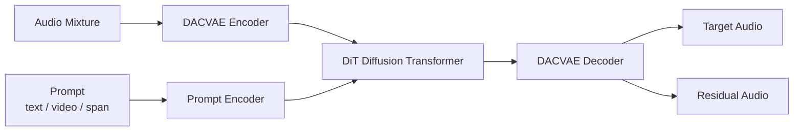

# SAM-Audio Documentation

> Segment Anything in Audio — a foundation model for isolating any sound using text, visual, or temporal prompts.

## Contents

| File | Description |
|------|-------------|
| [architecture.md](./architecture.md) | System architecture, component map, data-flow diagrams |
| [how-it-works.md](./how-it-works.md) | Detailed diffusion pipeline, sequence diagrams per prompting mode |
| [prompting-guide.md](./prompting-guide.md) | How to write effective prompts; flow diagrams for each mode |
| [setup-windows.md](./setup-windows.md) | Verified setup for Windows 11 + NVIDIA RTX 4070 |
| [deployment.md](./deployment.md) | Docker Compose and Kubernetes deployment recipes |
| [realtime-webrtc.md](./realtime-webrtc.md) | Near-real-time streaming via WebRTC/WebSocket — browser mic+camera → separated audio download |

## One-Paragraph Summary

SAM-Audio encodes an audio mixture through a VAE codec, then conditions a **Diffusion Transformer (DiT)** on natural-language, video-frame, or time-span prompts. An ODE solver drives the diffusion process from noise to a clean separation; the separated waveform is decoded back from codec features. Optional multi-candidate re-ranking with CLAP, Judge, or ImageBind selects the best result. The model ships in three sizes (small / base / large) and two training variants (standard and tv — target + visual).

