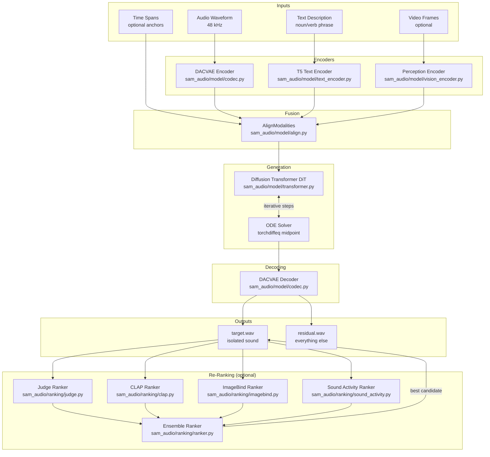
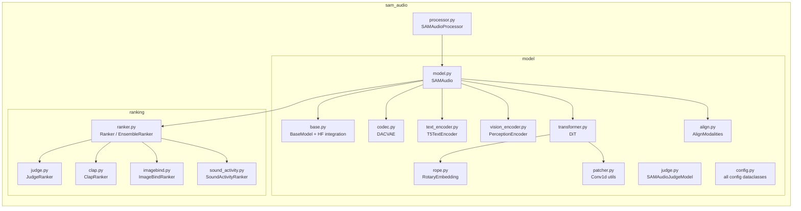
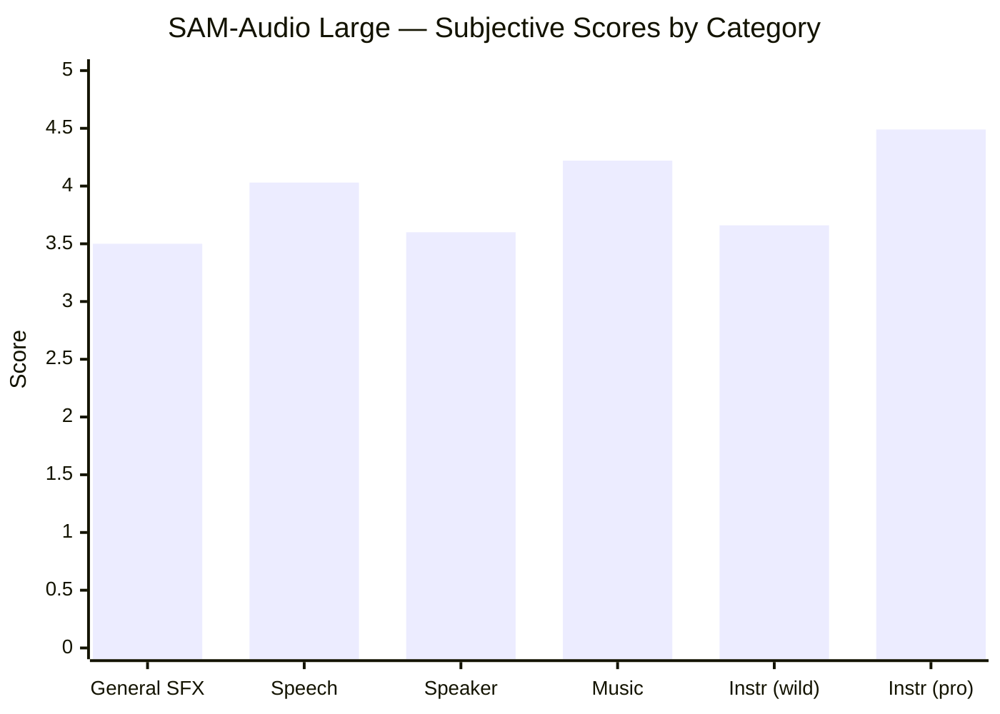
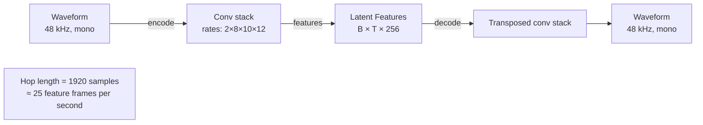
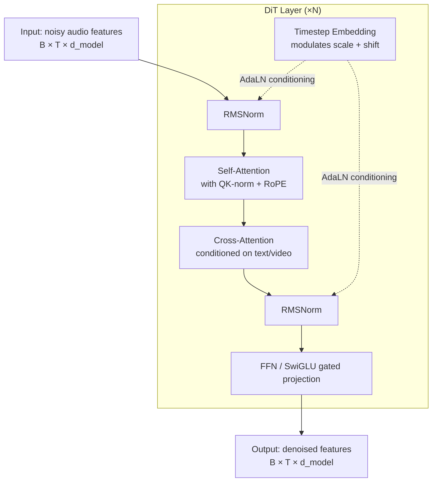
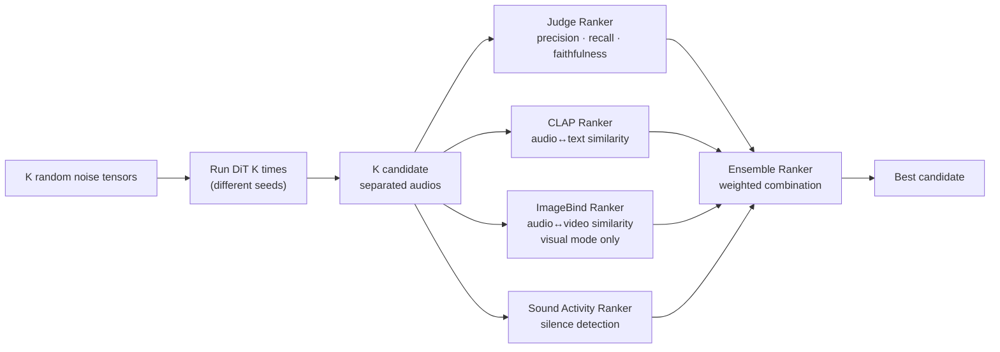

# SAM-Audio Architecture

## High-Level Component Map

---

## Package Structure

---

## Model Size Variants

| Variant | HuggingFace ID | Training focus |
|---------|---------------|----------------|
| Small | `facebook/sam-audio-small` | General, fastest |
| Base | `facebook/sam-audio-base` | Balanced |
| Large | `facebook/sam-audio-large` | Best overall quality |
| Small TV | `facebook/sam-audio-small-tv` | Better correctness + visual prompting |
| Base TV | `facebook/sam-audio-base-tv` | Better correctness + visual prompting |
| Large TV | `facebook/sam-audio-large-tv` | Best correctness + visual prompting |

### Performance Benchmark (subjective scores, higher = better)

---

## Codec Details — DACVAE

---

## Diffusion Transformer (DiT) Internals

---

## Re-Ranking Pipeline

When `reranking_candidates = K > 1`, SAM-Audio generates K independent candidates and selects the best:

