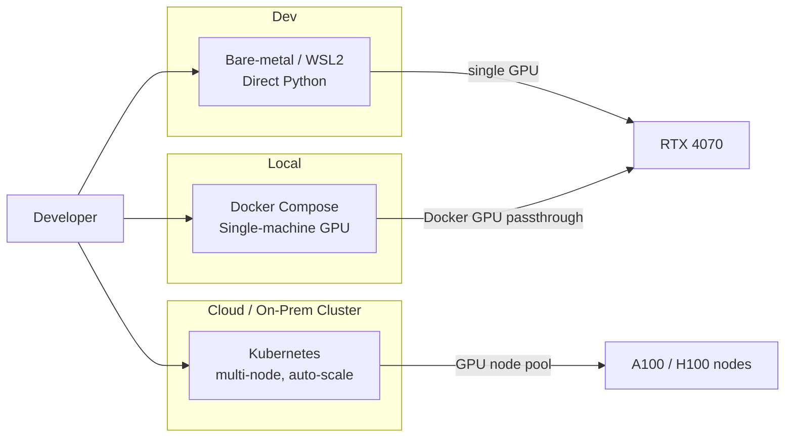
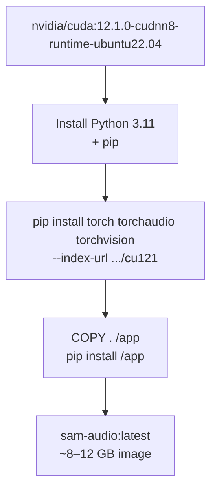
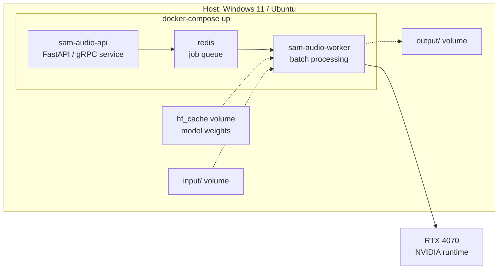
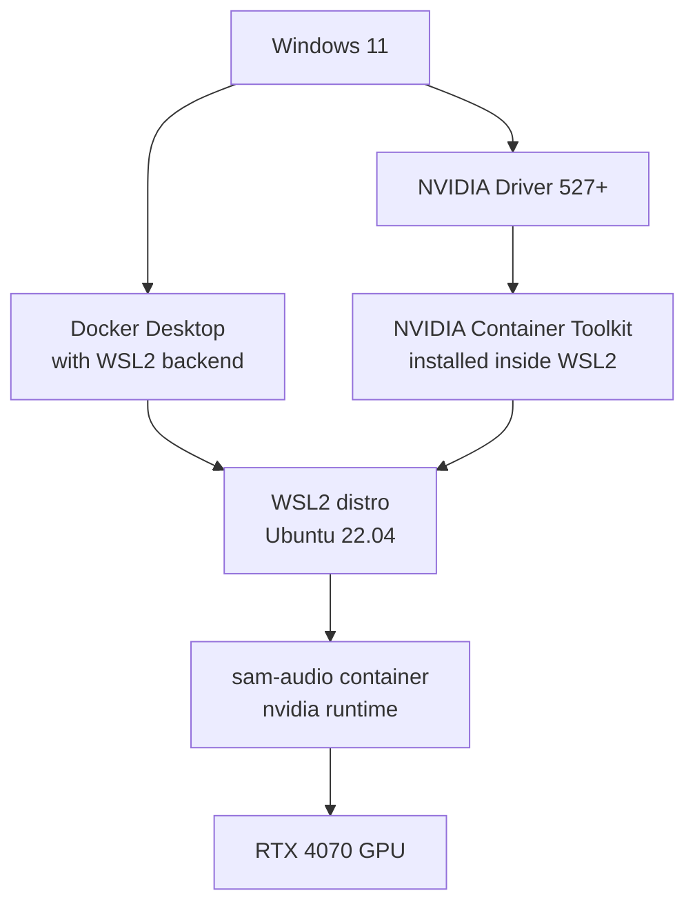
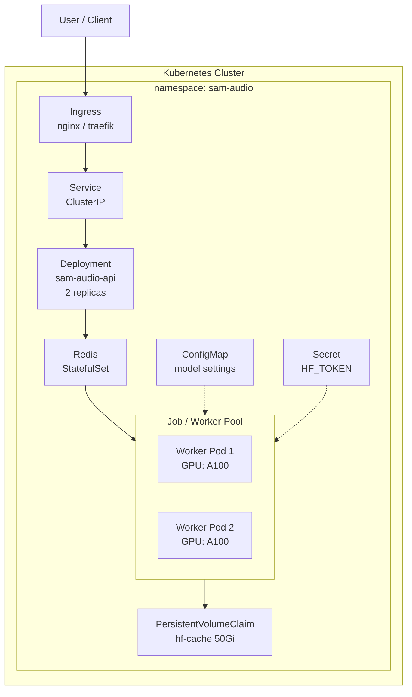
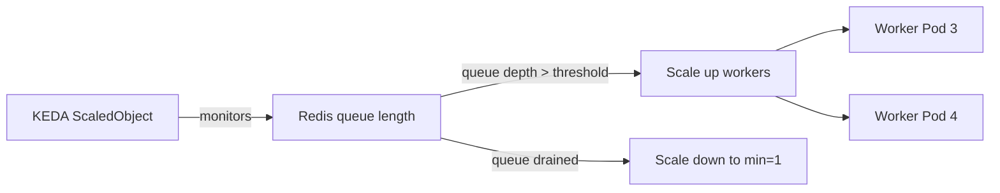

# Deployment Guide — Docker Compose & Kubernetes

## Deployment Options Overview



---

## Docker — Base Image



### Dockerfile

```dockerfile
FROM nvidia/cuda:12.1.0-cudnn8-runtime-ubuntu22.04

ENV DEBIAN_FRONTEND=noninteractive
RUN apt-get update && apt-get install -y \
    python3.11 python3.11-dev python3-pip git ffmpeg \
    && rm -rf /var/lib/apt/lists/*

RUN ln -sf /usr/bin/python3.11 /usr/bin/python && \
    ln -sf /usr/bin/pip3 /usr/bin/pip

WORKDIR /app

# Install PyTorch with CUDA 12.1
RUN pip install --no-cache-dir \
    torch torchaudio torchvision \
    --index-url https://download.pytorch.org/whl/cu121

# Install SAM-Audio dependencies
COPY pyproject.toml .
COPY sam_audio/ ./sam_audio/
RUN pip install --no-cache-dir .

# HuggingFace cache dir (mount or bake-in pre-downloaded weights)
ENV HF_HOME=/app/hf_cache
VOLUME ["/app/hf_cache", "/app/input", "/app/output"]

ENTRYPOINT ["python", "-m", "sam_audio"]
```

> **Important:** Model weights (~5–15 GB depending on variant) are downloaded at runtime from HuggingFace. Pre-download and mount as a volume in production to avoid cold-start delays.

---

## Docker Compose

Suitable for single-machine deployments (e.g., workstation with RTX 4070).



### docker-compose.yml

```yaml
version: "3.9"

services:
  redis:
    image: redis:7-alpine
    ports:
      - "6379:6379"
    volumes:
      - redis-data:/data

  sam-audio-worker:
    image: sam-audio:latest
    build:
      context: .
      dockerfile: Dockerfile
    runtime: nvidia
    environment:
      - NVIDIA_VISIBLE_DEVICES=all
      - NVIDIA_DRIVER_CAPABILITIES=compute,utility
      - HF_TOKEN=${HF_TOKEN}           # from .env
      - HF_HOME=/app/hf_cache
      - REDIS_URL=redis://redis:6379
      - SAM_MODEL=facebook/sam-audio-large
      - SAM_RERANKING_CANDIDATES=1     # 1 for RTX 4070 large model
    volumes:
      - hf-cache:/app/hf_cache
      - ./input:/app/input
      - ./output:/app/output
    depends_on:
      - redis
    deploy:
      resources:
        reservations:
          devices:
            - driver: nvidia
              count: 1
              capabilities: [gpu]

  sam-audio-api:
    image: sam-audio:latest
    command: ["python", "-m", "uvicorn", "serve.app:app", "--host", "0.0.0.0", "--port", "8000"]
    ports:
      - "8000:8000"
    environment:
      - REDIS_URL=redis://redis:6379
    depends_on:
      - redis

volumes:
  redis-data:
  hf-cache:
```

### .env file

```env
HF_TOKEN=hf_xxxxxxxxxxxxxxxxxxxxxxxxxxxx
```

### Usage

```bash
# Build
docker compose build

# Start (GPU passthrough works on Windows 11 with NVIDIA Container Toolkit in WSL2)
docker compose up -d

# Submit a separation job
curl -X POST http://localhost:8000/separate \
  -F "audio=@input/mix.wav" \
  -F "description=man speaking"

# Tail worker logs
docker compose logs -f sam-audio-worker
```

---

## Windows 11 + Docker Desktop — GPU Setup



```bash
# Inside WSL2 — install NVIDIA Container Toolkit
distribution=$(. /etc/os-release; echo $ID$VERSION_ID)
curl -fsSL https://nvidia.github.io/libnvidia-container/gpgkey | sudo gpg --dearmor \
  -o /usr/share/keyrings/nvidia-container-toolkit-keyring.gpg
curl -s -L https://nvidia.github.io/libnvidia-container/$distribution/libnvidia-container.list \
  | sed 's#deb https://#deb [signed-by=/usr/share/keyrings/nvidia-container-toolkit-keyring.gpg] https://#g' \
  | sudo tee /etc/apt/sources.list.d/nvidia-container-toolkit.list

sudo apt-get update && sudo apt-get install -y nvidia-container-toolkit
sudo nvidia-ctk runtime configure --runtime=docker
sudo systemctl restart docker

# Verify
docker run --rm --gpus all nvidia/cuda:12.1.0-base-ubuntu22.04 nvidia-smi
```

---

## Kubernetes Deployment

For production multi-GPU inference at scale.



### Kubernetes Manifests

#### namespace.yaml
```yaml
apiVersion: v1
kind: Namespace
metadata:
  name: sam-audio
```

#### secret.yaml
```yaml
apiVersion: v1
kind: Secret
metadata:
  name: hf-credentials
  namespace: sam-audio
type: Opaque
stringData:
  HF_TOKEN: "hf_xxxxxxxxxxxxxxxxxxxxxxxxxxxx"
```

#### configmap.yaml
```yaml
apiVersion: v1
kind: ConfigMap
metadata:
  name: sam-audio-config
  namespace: sam-audio
data:
  SAM_MODEL: "facebook/sam-audio-large"
  SAM_RERANKING_CANDIDATES: "4"
  HF_HOME: "/app/hf_cache"
  REDIS_URL: "redis://redis-service:6379"
```

#### pvc.yaml
```yaml
apiVersion: v1
kind: PersistentVolumeClaim
metadata:
  name: hf-cache-pvc
  namespace: sam-audio
spec:
  accessModes:
    - ReadWriteMany        # shared across worker pods
  resources:
    requests:
      storage: 50Gi
  storageClassName: standard
```

#### redis.yaml
```yaml
apiVersion: apps/v1
kind: StatefulSet
metadata:
  name: redis
  namespace: sam-audio
spec:
  serviceName: redis-service
  replicas: 1
  selector:
    matchLabels:
      app: redis
  template:
    metadata:
      labels:
        app: redis
    spec:
      containers:
        - name: redis
          image: redis:7-alpine
          ports:
            - containerPort: 6379
---
apiVersion: v1
kind: Service
metadata:
  name: redis-service
  namespace: sam-audio
spec:
  selector:
    app: redis
  ports:
    - port: 6379
```

#### worker-deployment.yaml
```yaml
apiVersion: apps/v1
kind: Deployment
metadata:
  name: sam-audio-worker
  namespace: sam-audio
spec:
  replicas: 2
  selector:
    matchLabels:
      app: sam-audio-worker
  template:
    metadata:
      labels:
        app: sam-audio-worker
    spec:
      containers:
        - name: worker
          image: your-registry/sam-audio:latest
          command: ["python", "-m", "sam_audio.worker"]
          envFrom:
            - configMapRef:
                name: sam-audio-config
            - secretRef:
                name: hf-credentials
          volumeMounts:
            - name: hf-cache
              mountPath: /app/hf_cache
            - name: output
              mountPath: /app/output
          resources:
            requests:
              nvidia.com/gpu: "1"
              memory: "16Gi"
              cpu: "4"
            limits:
              nvidia.com/gpu: "1"
              memory: "24Gi"
              cpu: "8"
      volumes:
        - name: hf-cache
          persistentVolumeClaim:
            claimName: hf-cache-pvc
        - name: output
          emptyDir: {}
      tolerations:
        - key: nvidia.com/gpu
          operator: Exists
          effect: NoSchedule
      nodeSelector:
        accelerator: nvidia-a100       # target GPU node pool
```

#### api-deployment.yaml
```yaml
apiVersion: apps/v1
kind: Deployment
metadata:
  name: sam-audio-api
  namespace: sam-audio
spec:
  replicas: 2
  selector:
    matchLabels:
      app: sam-audio-api
  template:
    metadata:
      labels:
        app: sam-audio-api
    spec:
      containers:
        - name: api
          image: your-registry/sam-audio:latest
          command: ["uvicorn", "serve.app:app", "--host", "0.0.0.0", "--port", "8000"]
          ports:
            - containerPort: 8000
          envFrom:
            - configMapRef:
                name: sam-audio-config
          resources:
            requests:
              memory: "512Mi"
              cpu: "250m"
            limits:
              memory: "1Gi"
              cpu: "1"
---
apiVersion: v1
kind: Service
metadata:
  name: sam-audio-api-service
  namespace: sam-audio
spec:
  selector:
    app: sam-audio-api
  ports:
    - port: 80
      targetPort: 8000
```

### Deploy

```bash
kubectl apply -f k8s/namespace.yaml
kubectl apply -f k8s/secret.yaml
kubectl apply -f k8s/configmap.yaml
kubectl apply -f k8s/pvc.yaml
kubectl apply -f k8s/redis.yaml
kubectl apply -f k8s/worker-deployment.yaml
kubectl apply -f k8s/api-deployment.yaml

# Check pods
kubectl get pods -n sam-audio

# Tail worker logs
kubectl logs -n sam-audio -l app=sam-audio-worker -f
```

---

## Horizontal Pod Autoscaler (HPA)

Scale workers automatically based on Redis queue depth via KEDA:



```yaml
apiVersion: keda.sh/v1alpha1
kind: ScaledObject
metadata:
  name: sam-audio-worker-scaler
  namespace: sam-audio
spec:
  scaleTargetRef:
    name: sam-audio-worker
  minReplicaCount: 1
  maxReplicaCount: 8
  triggers:
    - type: redis
      metadata:
        address: redis-service.sam-audio.svc.cluster.local:6379
        listName: sam-audio-jobs
        listLength: "3"      # scale up when queue > 3 jobs per pod
```

---

## Deployment Comparison

| Aspect | Docker Compose | Kubernetes |
|--------|---------------|------------|
| Setup complexity | Low | High |
| Multi-GPU | Single host only | Multi-node native |
| Auto-scaling | Manual | HPA / KEDA |
| Best for | Dev, single-server | Production, HA |
| GPU on Windows 11 | WSL2 + NVIDIA CT | Cloud node pools |
| Model weight caching | Named volume | PVC (ReadWriteMany) |
| Zero-downtime deploy | No | Rolling update |
