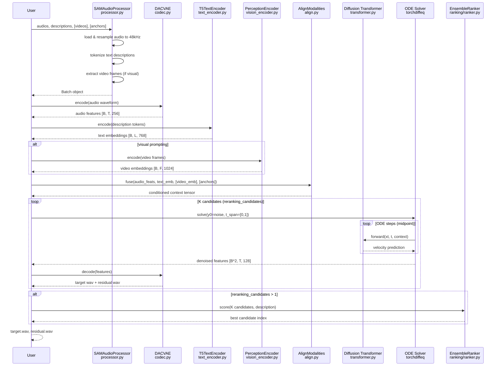
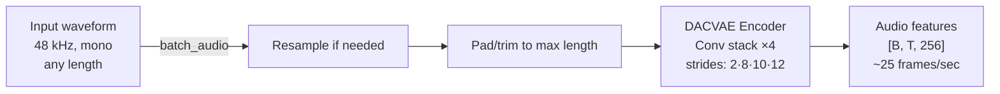
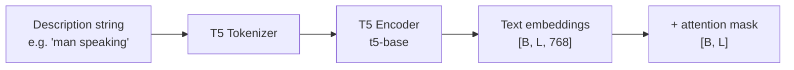
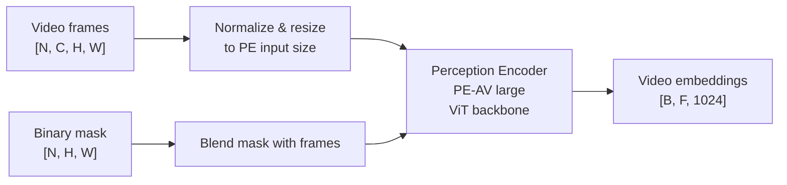
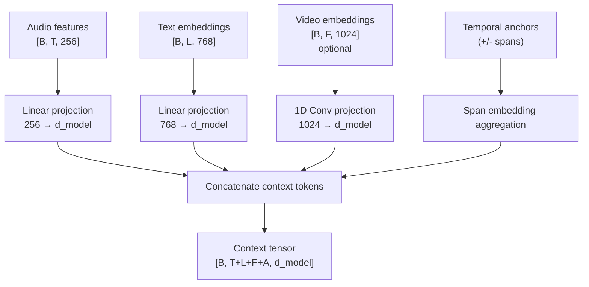
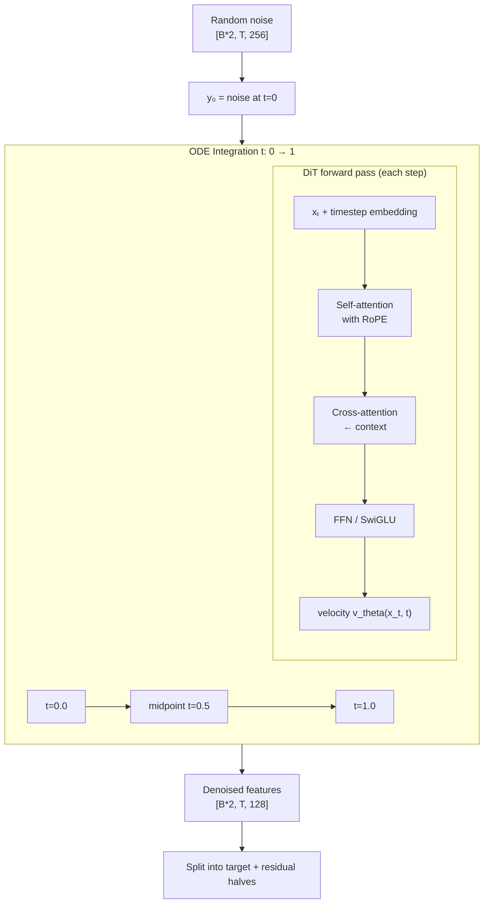
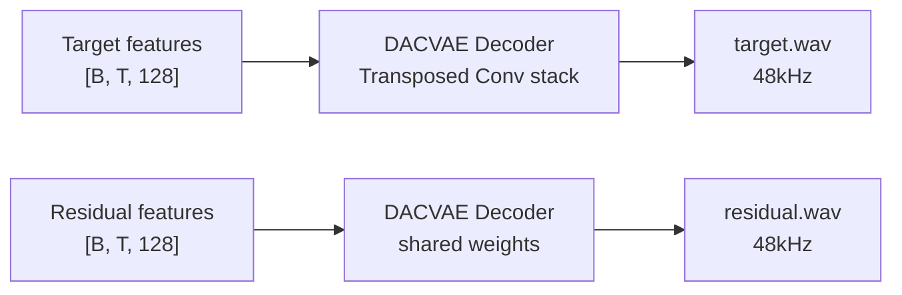
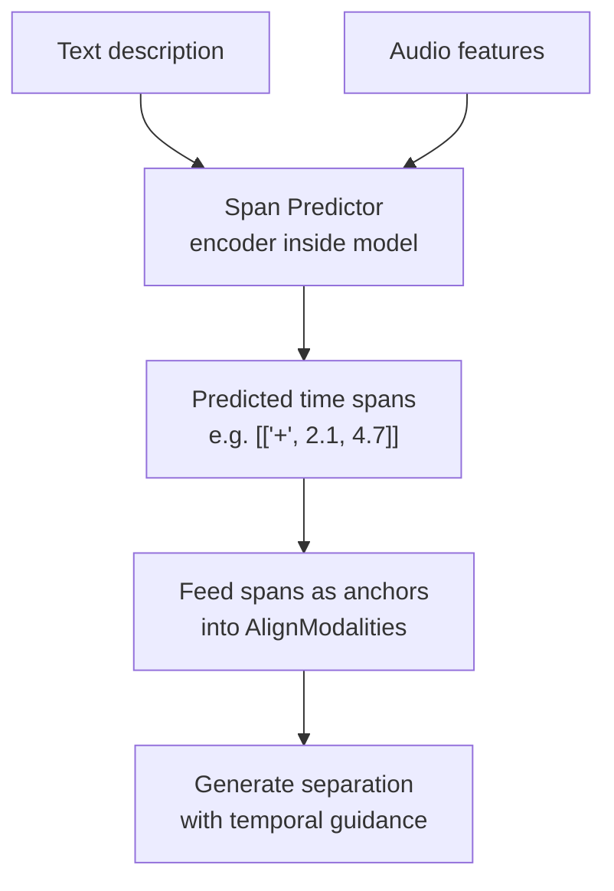
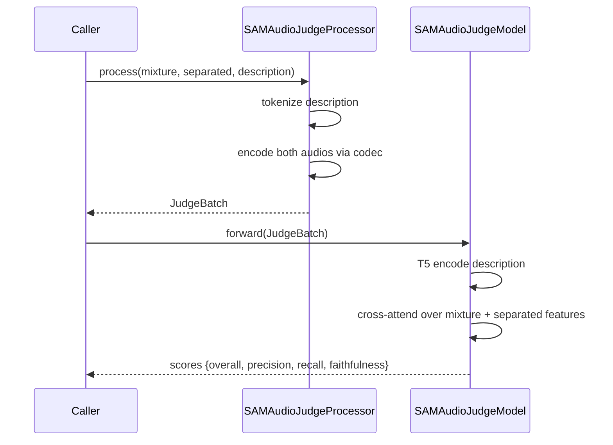

# How SAM-Audio Works

## End-to-End Inference — Sequence Diagram

---

## Step-by-Step Data Flow

### Step 1 — Audio Encoding

### Step 2 — Text Encoding

### Step 3 — Visual Encoding (optional)

### Step 4 — Modality Alignment

### Step 5 — Diffusion Generation (ODE)

### Step 6 — Audio Decoding

---

## Span Prediction Flow (predict_spans=True)

When enabled, SAM-Audio first predicts the *when* before the *what*:

---

## Judge Model — Quality Scoring

The Judge model is a separate evaluator, not used during generation:

