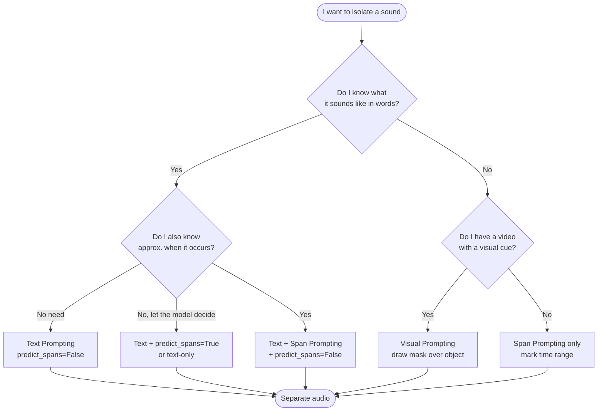
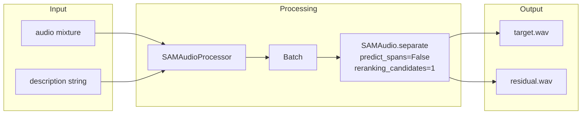
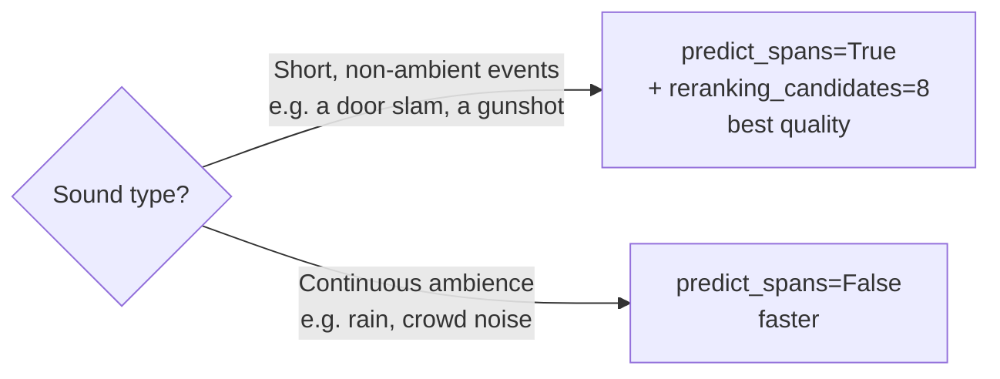
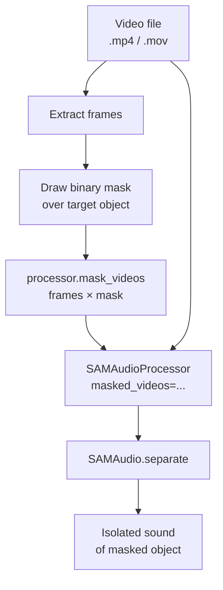
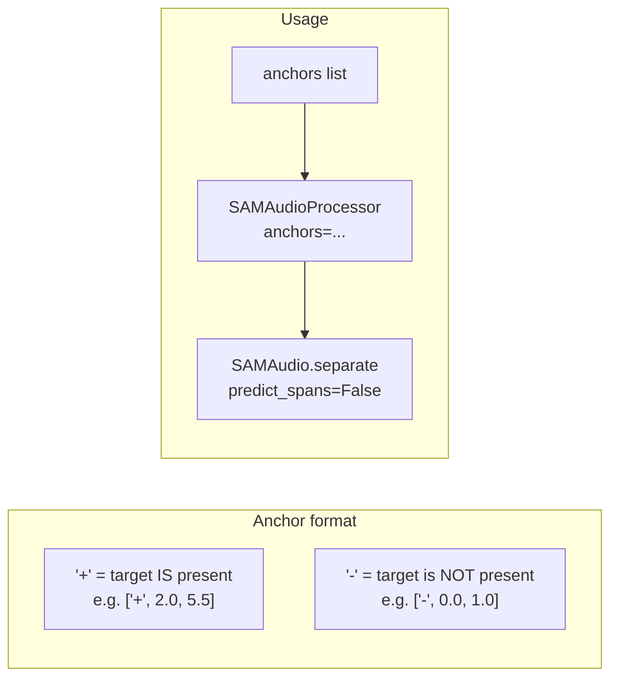
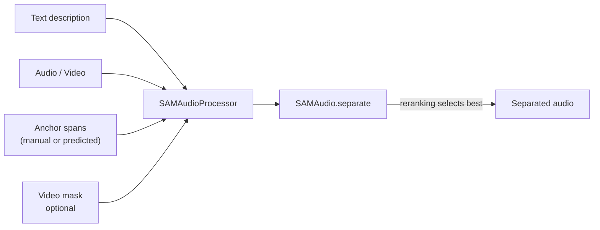
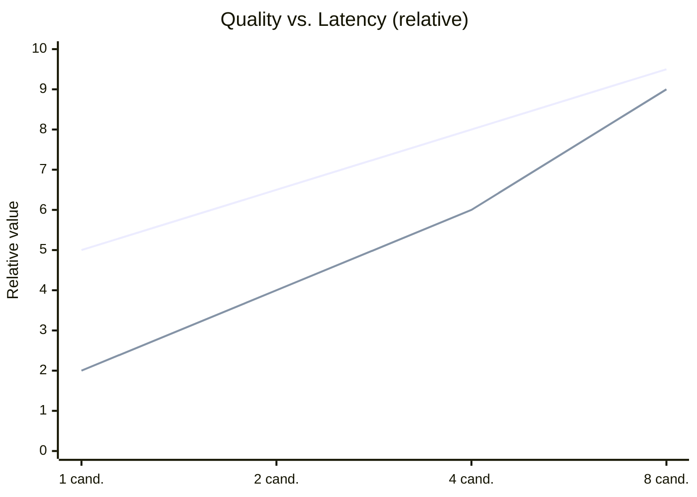

# Prompting Guide

SAM-Audio supports three independent prompting strategies. They can be combined (e.g., text + span) for better results.

---

## Decision Tree — Choosing a Prompt Mode



---

## Mode 1 — Text Prompting

Describe the target sound using a lowercase noun phrase or verb phrase.



### Tips for good text descriptions

| Instead of... | Use... | Why |
|---------------|--------|-----|
| "There is a man talking" | `"man speaking"` | Match training NP/VP format |
| "Dog" | `"dog barking"` | Include action for specificity |
| "Music in background" | `"background music"` | Noun phrase preferred |
| "The loud thunder sound" | `"thunder"` | Keep it concise |

### When to use `predict_spans`



---

## Mode 2 — Visual Prompting

Isolate sounds associated with a visible object in a video by drawing a mask.



```python
frames, mask = extract_frames_and_mask(video_path)
masked = processor.mask_videos([frames], [mask])

batch = processor(
    audios=[video_path],
    descriptions=[""],          # empty or hint text
    masked_videos=masked,
).to("cuda")

result = model.separate(batch)
```

**Re-ranking for visual mode** uses ImageBind (audio ↔ video similarity) automatically when `masked_videos` is provided.

---

## Mode 3 — Span Prompting

Specify the time ranges (in seconds) where the target sound occurs.



```python
# "dog barking" appears at 6.3–7.0 s and NOT at 0–2 s
anchors = [[
    ["+", 6.3, 7.0],
    ["-", 0.0, 2.0],   # optional negative span
]]

batch = processor(
    audios=[audio_path],
    descriptions=["dog barking"],
    anchors=anchors,
).to("cuda")
```

---

## Combining Modes

All three modes compose naturally:



---

## Re-Ranking Quality vs. Latency Trade-off



| Setting | Use case |
|---------|----------|
| `reranking_candidates=1` | Real-time / batch with tight latency |
| `reranking_candidates=4` | Good balance for most use cases |
| `reranking_candidates=8` | Highest quality, offline processing |
