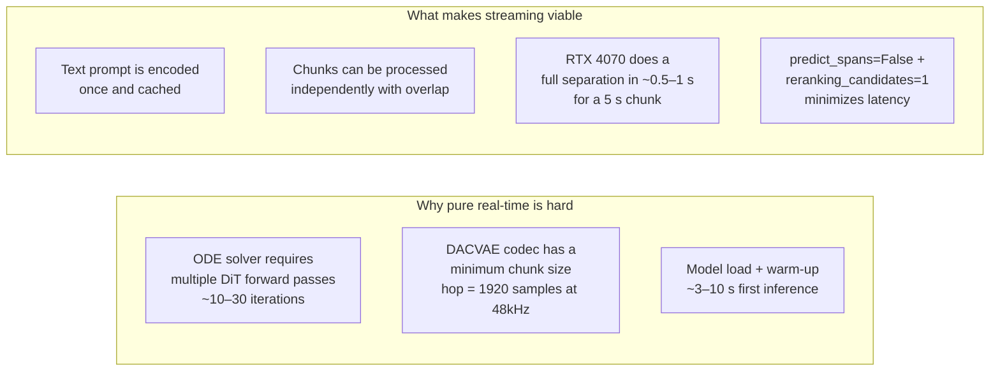
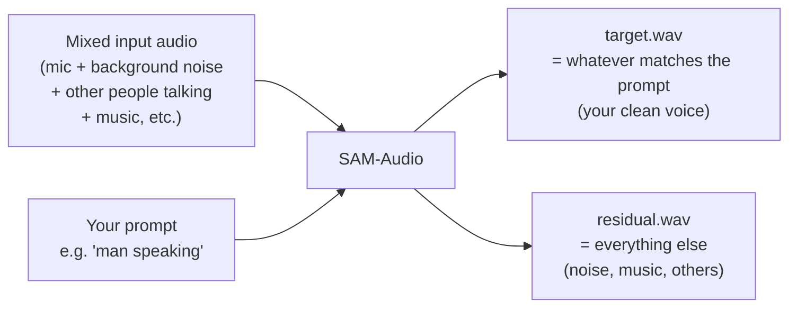
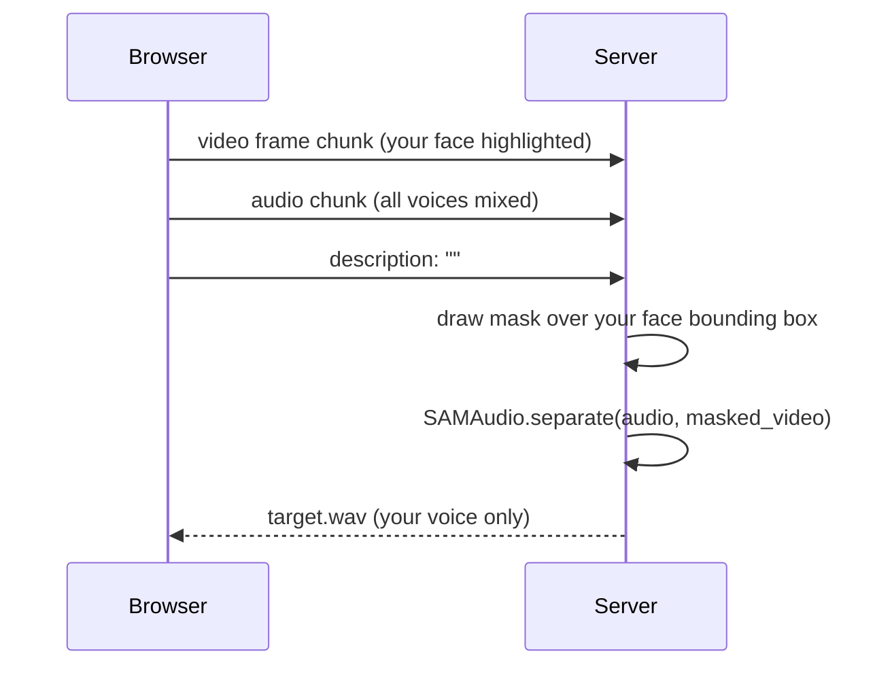
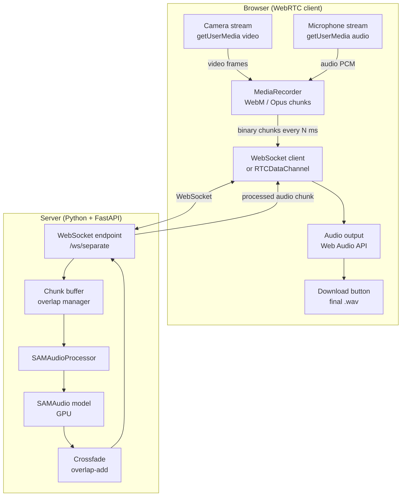
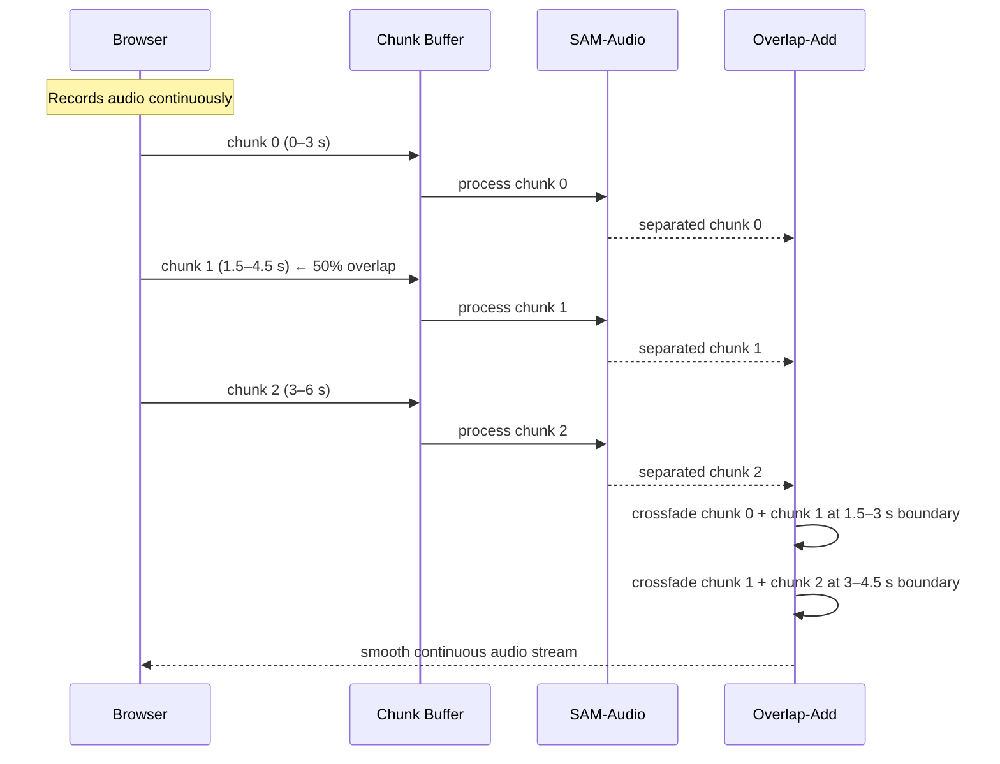
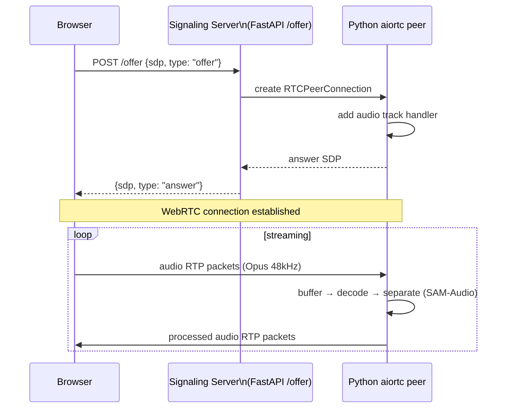
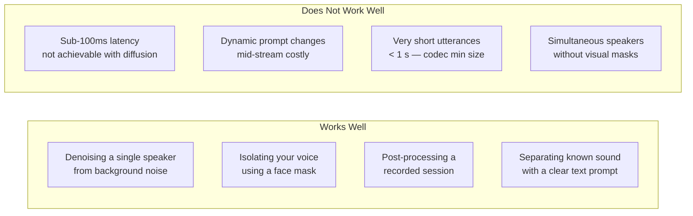
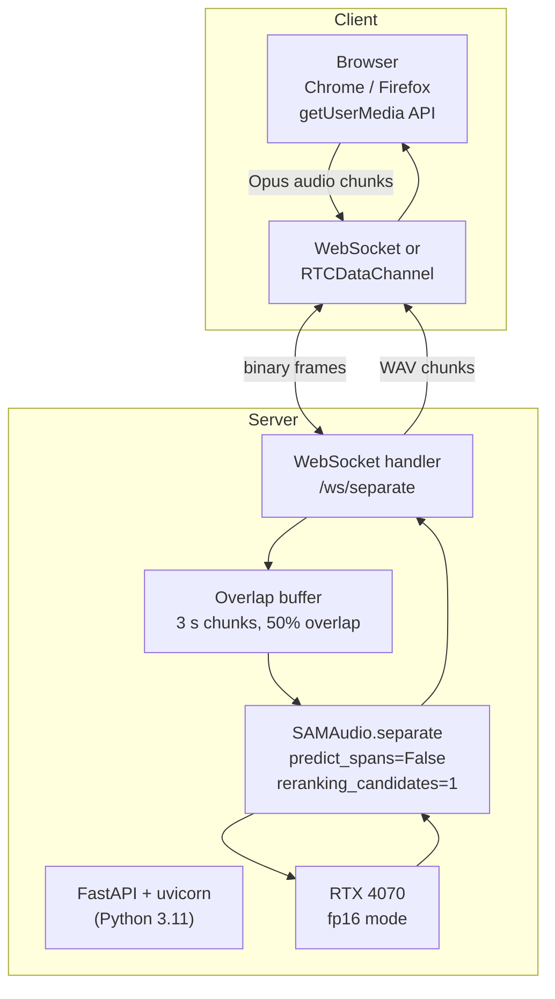

# Real-Time Audio Separation with WebRTC

## Can SAM-Audio Run in Real Time?

**Short answer: not true real-time, but near-real-time streaming (2–5 s latency) is achievable.**

Here is why:



### Latency Budget (RTX 4070, `sam-audio-large`)

| Stage | Latency | Can be hidden? |
|-------|---------|----------------|
| Browser capture → server (WebRTC) | ~20–80 ms | Yes, pipeline |
| DACVAE encode chunk | ~30 ms | Yes, pipeline |
| T5 text encode | ~50 ms | Yes, **cached after first call** |
| DiT ODE solve (1 candidate) | ~400–800 ms | Partially, overlap chunks |
| DACVAE decode | ~30 ms | Yes, pipeline |
| Server → browser (WebRTC) | ~20–80 ms | Yes, pipeline |
| **Total perceived latency** | **~2–4 s** | With 3 s chunks + 50% overlap |

> True sub-100ms real-time (like a phone call) is **not** achievable with a diffusion model on current hardware. This is a **streaming separation** system, not a live filter.

---

## Which Audio Source Gets Picked?

This is the most important conceptual point.

SAM-Audio does **not** automatically know there are multiple sources. You tell it what to keep via the prompt. The model always outputs two streams:



### Practical examples for a browser scenario

| Scenario | Prompt to use | `target.wav` contains |
|----------|--------------|----------------------|
| Denoise your own voice | `"person speaking"` | Your clean voice |
| Isolate a specific speaker | `"woman speaking"` or visual mask | That speaker only |
| Remove background music | `"background music"` → use residual | Voice without music |
| Isolate instrument in a mix | `"guitar"` | Guitar track |
| Keep only your voice from a conference call | `"speaker"` + visual mask of your face | Your voice |

### Visual prompting for multi-speaker disambiguation

If there are multiple people speaking, text alone may pick the wrong one. Use the **video stream + a face mask** to tell the model *whose* voice to keep:



---

## System Architecture



---

## Chunked Streaming Pipeline

The key technique is **overlap-add**: send overlapping chunks to the model, crossfade the outputs to eliminate boundary artifacts.



### Overlap-Add Parameters

| Chunk size | Overlap | Latency | GPU util | Artifact risk |
|-----------|---------|---------|----------|---------------|
| 2 s | 1 s (50%) | ~3 s | High | Low |
| 3 s | 1.5 s (50%) | ~4.5 s | Medium | Very low |
| 5 s | 2 s (40%) | ~7 s | Low | Negligible |

> **Recommended for RTX 4070 + `sam-audio-large`**: 3 s chunks, 1.5 s overlap, `reranking_candidates=1`, `predict_spans=False`.

---

## Browser Code (client side)

```html
<!DOCTYPE html>
<html>
<head><title>SAM-Audio Live</title></head>
<body>
  <video id="preview" autoplay muted></video>
  <input id="description" type="text" value="person speaking" placeholder="What to keep?">
  <button id="start">Start</button>
  <button id="stop" disabled>Stop</button>
  <a id="download" style="display:none">Download result</a>

  <script>
    const WS_URL = "ws://localhost:8000/ws/separate";
    const CHUNK_MS = 3000;
    const MIME = "audio/webm;codecs=opus";

    let ws, mediaRecorder, stream;
    const receivedChunks = [];

    document.getElementById("start").onclick = async () => {
      // 1. Capture mic + camera
      stream = await navigator.mediaDevices.getUserMedia({
        audio: { sampleRate: 48000, channelCount: 1 },
        video: true,
      });
      document.getElementById("preview").srcObject = stream;

      // 2. Open WebSocket
      ws = new WebSocket(WS_URL);
      ws.binaryType = "arraybuffer";

      const description = document.getElementById("description").value;
      ws.onopen = () => ws.send(JSON.stringify({ description }));

      ws.onmessage = (event) => {
        receivedChunks.push(new Uint8Array(event.data));
      };

      // 3. Record in rolling chunks
      mediaRecorder = new MediaRecorder(stream, { mimeType: MIME });
      mediaRecorder.ondataavailable = (e) => {
        if (e.data.size > 0 && ws.readyState === WebSocket.OPEN) {
          e.data.arrayBuffer().then((buf) => ws.send(buf));
        }
      };
      mediaRecorder.start(CHUNK_MS);

      document.getElementById("start").disabled = true;
      document.getElementById("stop").disabled = false;
    };

    document.getElementById("stop").onclick = () => {
      mediaRecorder.stop();
      ws.close();
      stream.getTracks().forEach((t) => t.stop());

      // Assemble downloaded result
      const blob = new Blob(receivedChunks, { type: "audio/wav" });
      const url = URL.createObjectURL(blob);
      const dl = document.getElementById("download");
      dl.href = url;
      dl.download = "separated.wav";
      dl.style.display = "block";
      dl.textContent = "Download separated.wav";

      document.getElementById("start").disabled = false;
      document.getElementById("stop").disabled = true;
    };
  </script>
</body>
</html>
```

---

## Server Code (Python + FastAPI)

```python
# serve/app.py
import asyncio
import io
import json
import numpy as np
import torch
import torchaudio
from fastapi import FastAPI, WebSocket, WebSocketDisconnect
from sam_audio import SAMAudio, SAMAudioProcessor

app = FastAPI()

# Load model once at startup
MODEL_ID = "facebook/sam-audio-large"
processor = SAMAudioProcessor.from_pretrained(MODEL_ID)
model = SAMAudio.from_pretrained(MODEL_ID).eval().half().cuda()

SAMPLE_RATE = 48_000
CHUNK_SECONDS = 3
OVERLAP_SECONDS = 1.5
CHUNK_SAMPLES = CHUNK_SECONDS * SAMPLE_RATE
OVERLAP_SAMPLES = int(OVERLAP_SECONDS * SAMPLE_RATE)


def decode_webm_chunk(raw: bytes) -> torch.Tensor:
    """Decode a WebM/Opus binary chunk to a float32 mono tensor at 48kHz."""
    buf = io.BytesIO(raw)
    waveform, sr = torchaudio.load(buf, format="ogg")
    if sr != SAMPLE_RATE:
        waveform = torchaudio.functional.resample(waveform, sr, SAMPLE_RATE)
    return waveform.mean(dim=0)  # mono


def separate_chunk(audio: torch.Tensor, description: str) -> torch.Tensor:
    batch = processor(
        audios=[audio],
        descriptions=[description],
    ).to("cuda")
    with torch.inference_mode():
        result = model.separate(batch, predict_spans=False, reranking_candidates=1)
    return result.target.squeeze(0).cpu()


def crossfade(prev: torch.Tensor, curr: torch.Tensor, overlap: int) -> torch.Tensor:
    """Overlap-add two chunks with a linear crossfade over `overlap` samples."""
    fade_out = torch.linspace(1, 0, overlap)
    fade_in  = torch.linspace(0, 1, overlap)
    mixed = prev[-overlap:] * fade_out + curr[:overlap] * fade_in
    return torch.cat([prev[:-overlap], mixed, curr[overlap:]])


@app.websocket("/ws/separate")
async def websocket_separate(ws: WebSocket):
    await ws.accept()

    # First message: JSON config
    config = json.loads(await ws.receive_text())
    description = config.get("description", "person speaking")

    pcm_buffer = torch.zeros(0)
    prev_output: torch.Tensor | None = None
    loop = asyncio.get_event_loop()

    try:
        while True:
            raw = await ws.receive_bytes()
            chunk_pcm = await loop.run_in_executor(None, decode_webm_chunk, raw)
            pcm_buffer = torch.cat([pcm_buffer, chunk_pcm])

            # Process once we have enough audio
            while len(pcm_buffer) >= CHUNK_SAMPLES:
                chunk = pcm_buffer[:CHUNK_SAMPLES]
                pcm_buffer = pcm_buffer[CHUNK_SAMPLES - OVERLAP_SAMPLES:]  # keep overlap

                separated = await loop.run_in_executor(
                    None, separate_chunk, chunk, description
                )

                if prev_output is not None:
                    output = crossfade(prev_output, separated, OVERLAP_SAMPLES)
                    # Send everything except the trailing overlap (still needs blending)
                    to_send = output[:-OVERLAP_SAMPLES]
                else:
                    to_send = separated[OVERLAP_SAMPLES:]  # skip first overlap (silence)

                prev_output = separated

                # Encode as WAV and send
                buf = io.BytesIO()
                torchaudio.save(buf, to_send.unsqueeze(0), SAMPLE_RATE, format="wav")
                await ws.send_bytes(buf.getvalue())

    except WebSocketDisconnect:
        pass
```

Run the server:

```bash
uvicorn serve.app:app --host 0.0.0.0 --port 8000 --workers 1
```

> Use `--workers 1` — the GPU model is not process-safe to share across multiple workers. For horizontal scaling, use multiple containers behind a load balancer instead (see [deployment.md](./deployment.md)).

---

## Full WebRTC Flow (with signaling)

For lower latency than WebSocket, use a proper WebRTC data channel:



```python
# serve/webrtc.py  (requires: pip install aiortc)
from aiortc import RTCPeerConnection, RTCSessionDescription, MediaStreamTrack
from aiortc.contrib.media import MediaRecorder
import asyncio, fractions
import av

class SeparationTrack(MediaStreamTrack):
    kind = "audio"

    def __init__(self, source_track, description):
        super().__init__()
        self._source = source_track
        self._description = description
        self._buffer = []

    async def recv(self):
        frame = await self._source.recv()
        # frame is an av.AudioFrame at 48kHz
        # accumulate frames → run SAM-Audio → return processed frame
        # (full implementation: buffer until CHUNK_SAMPLES, then separate)
        return frame  # passthrough placeholder

@app.post("/offer")
async def offer(params: dict):
    pc = RTCPeerConnection()
    desc = RTCSessionDescription(sdp=params["sdp"], type=params["type"])
    await pc.setRemoteDescription(desc)

    @pc.on("track")
    def on_track(track):
        if track.kind == "audio":
            processed = SeparationTrack(track, description="person speaking")
            pc.addTrack(processed)

    answer = await pc.createAnswer()
    await pc.setLocalDescription(answer)
    return {"sdp": pc.localDescription.sdp, "type": pc.localDescription.type}
```

---

## Limitations & Honest Trade-offs



| Requirement | Achievable? | Notes |
|-------------|:-----------:|-------|
| Download final `.wav` | ✅ | Trivially — accumulate all returned chunks |
| Hear separation in near-real-time | ✅ | ~2–4 s lag with chunked streaming |
| Phone-call latency (< 100 ms) | ❌ | Diffusion model physics — not solvable |
| Separate your voice from one other speaker | ✅ | Use visual mask or gendered text prompt |
| Separate N simultaneous speakers | ⚠️ | Run N parallel inference sessions, one per target |
| Process audio without GPU | ❌ | CPU inference is 50–100× slower |
| Mobile browser | ⚠️ | WebRTC capture works; processing stays server-side |

---

## Recommended Stack Summary



Install additional server dependencies:

```bash
pip install fastapi uvicorn[standard] python-multipart aiortc av
```
