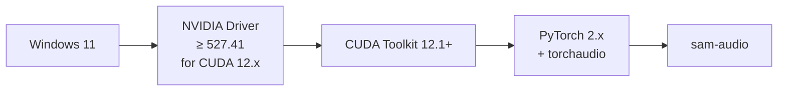
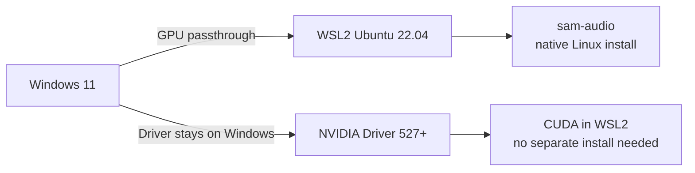
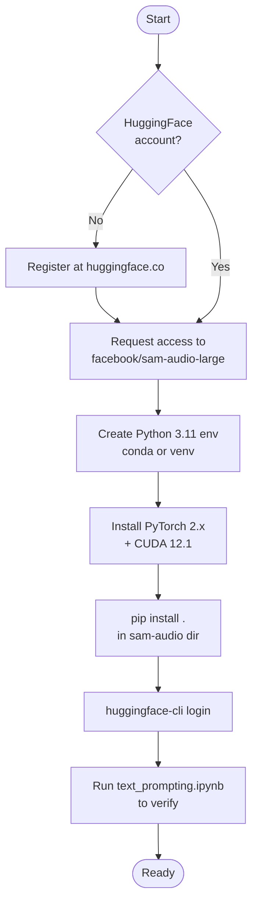

# Setup Guide — Windows 11 + NVIDIA RTX 4070

This guide covers a verified local setup for SAM-Audio on Windows 11 with an NVIDIA GeForce RTX 4070.

---

## Hardware & OS Compatibility

### Supported Platforms

| Platform | Status | Notes |
|----------|--------|-------|
| Windows 11 (x64) | Supported | Requires WSL2 or native conda env |
| Ubuntu 20.04 / 22.04 | Fully supported | CI runs on Ubuntu |
| macOS (M-series) | Partial | CPU-only; no CUDA |
| macOS (Intel) | Not recommended | Very slow without CUDA |

### Supported GPUs

SAM-Audio requires a CUDA-capable GPU. The RTX 4070 is a strong fit:

| GPU | VRAM | CUDA Arch | sam-audio-small | sam-audio-base | sam-audio-large |
|-----|------|-----------|:-:|:-:|:-:|
| RTX 4070 | 12 GB | Ada (sm_89) | ✅ | ✅ | ✅ (tight) |
| RTX 4070 Ti | 12 GB | Ada (sm_89) | ✅ | ✅ | ✅ |
| RTX 4080 | 16 GB | Ada (sm_89) | ✅ | ✅ | ✅ comfortable |
| RTX 4090 | 24 GB | Ada (sm_89) | ✅ | ✅ | ✅ + reranking K=8 |
| RTX 3080 | 10 GB | Ampere (sm_86) | ✅ | ⚠️ tight | ❌ OOM |
| RTX 3090 | 24 GB | Ampere (sm_86) | ✅ | ✅ | ✅ |
| A100 80GB | 80 GB | Ampere (sm_80) | ✅ | ✅ | ✅ multi-batch |

> **RTX 4070 tip:** Run `sam-audio-large` with `reranking_candidates=1`. Increase to 4 if you have headroom after loading (use `torch.cuda.memory_summary()` to check).

### CUDA / Driver Requirements



Check your current driver and CUDA version:
```powershell
nvidia-smi
nvcc --version
```

---

## Option A — Native Windows (Conda / pip)

### 1. Install Miniconda

Download [Miniconda for Windows](https://docs.conda.io/en/latest/miniconda.html) and install.

### 2. Create the environment

```powershell
conda create -n sam-audio python=3.11 -y
conda activate sam-audio
```

### 3. Install PyTorch with CUDA 12.1

```powershell
pip install torch torchaudio torchvision --index-url https://download.pytorch.org/whl/cu121
```

### 4. Install SAM-Audio

```powershell
cd path\to\sam-audio
pip install .
```

### 5. Authenticate with Hugging Face (required for checkpoints)

```powershell
pip install huggingface_hub
huggingface-cli login
```

Request access to [`facebook/sam-audio-large`](https://huggingface.co/facebook/sam-audio-large) first.

### 6. Verify GPU is detected

```python
import torch
print(torch.cuda.is_available())          # True
print(torch.cuda.get_device_name(0))      # NVIDIA GeForce RTX 4070
print(torch.cuda.mem_get_info())          # (free, total) in bytes
```

---

## Option B — WSL2 (Recommended for full compatibility)

WSL2 gives you the Ubuntu environment that matches CI and Docker, while still using your RTX 4070 via the Windows NVIDIA driver.



### Steps

```bash
# 1. Enable WSL2 (PowerShell as admin)
wsl --install -d Ubuntu-22.04

# 2. Inside WSL2 — install Miniconda
wget https://repo.anaconda.com/miniconda/Miniconda3-latest-Linux-x86_64.sh
bash Miniconda3-latest-Linux-x86_64.sh

# 3. Create env and install
conda create -n sam-audio python=3.11 -y
conda activate sam-audio
pip install torch torchaudio torchvision --index-url https://download.pytorch.org/whl/cu121
cd /path/to/sam-audio
pip install .
```

CUDA will work out of the box in WSL2 via the Windows driver — no separate CUDA toolkit install needed.

---

## Setup Flow Summary



---

## Memory Usage on RTX 4070 (12 GB VRAM)

| Model | `reranking_candidates` | Approx VRAM |
|-------|------------------------|-------------|
| sam-audio-small | 1 | ~4 GB |
| sam-audio-small | 8 | ~6 GB |
| sam-audio-base | 1 | ~6 GB |
| sam-audio-base | 4 | ~8 GB |
| sam-audio-large | 1 | ~9–11 GB |
| sam-audio-large | 4 | OOM risk |

> Use `model.half()` (fp16) to reduce VRAM by ~40% with minimal quality loss on Ada GPUs.

```python
model = SAMAudio.from_pretrained("facebook/sam-audio-large")
model = model.eval().half().cuda()   # fp16 on RTX 4070
```

---

## Troubleshooting

| Symptom | Cause | Fix |
|---------|-------|-----|
| `CUDA out of memory` | VRAM exceeded | Use smaller model or `model.half()` |
| `RuntimeError: no kernel image` | Wrong CUDA arch | Reinstall PyTorch matching your CUDA |
| `401 Unauthorized` on HF download | Not logged in or no access | `huggingface-cli login` + request model access |
| Slow inference on CPU | GPU not detected | Check `torch.cuda.is_available()` |
| Audio artifacts | Wrong sample rate | Ensure input is 48kHz or let processor resample |
