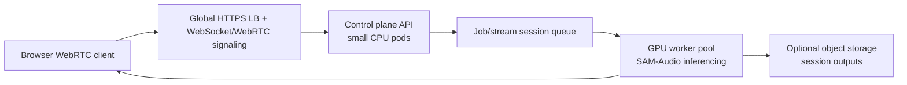
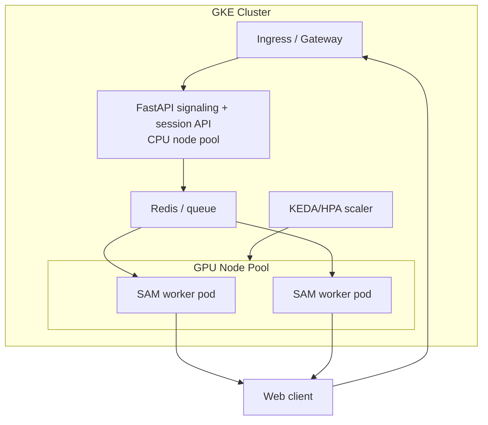
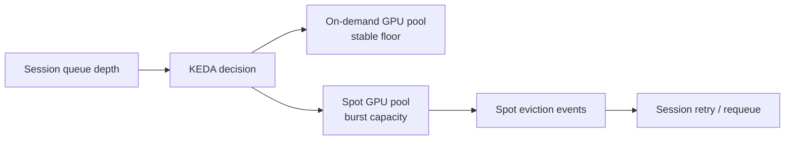
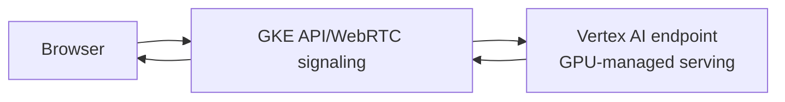
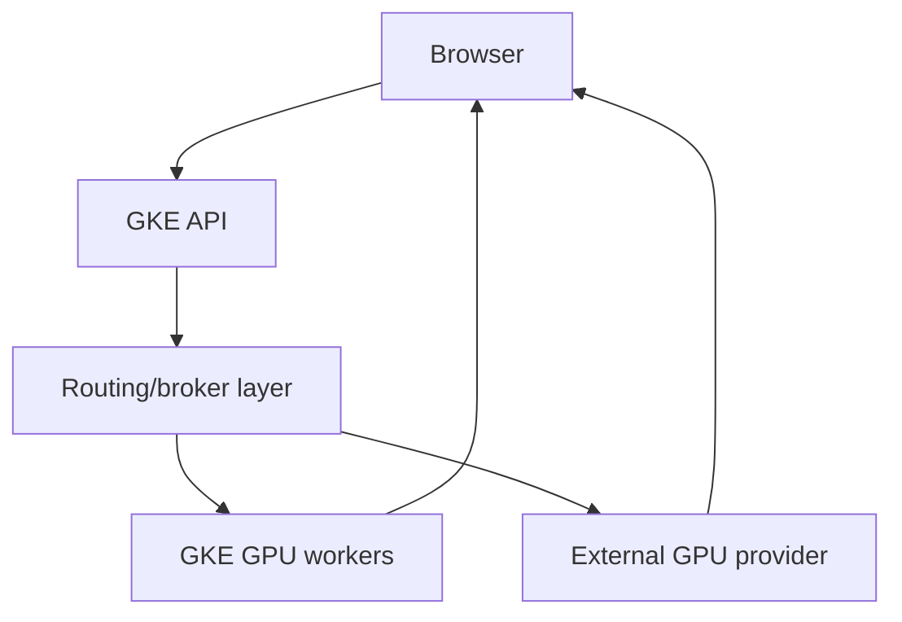
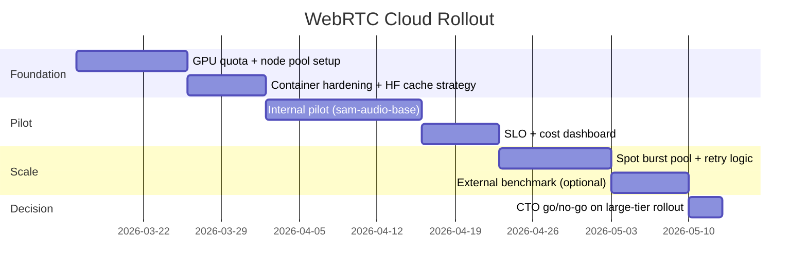

# WebRTC + SAM-Audio in the Cloud (CTO Brief)

This document outlines practical cloud deployment options for the WebRTC pipeline, with tradeoffs in cost, developer experience, iteration speed, and shutdown behavior.

It is based on current project constraints from `doc/setup-windows.md` and `doc/realtime-webrtc.md`:
- `sam-audio-base` fits comfortably on ~8 GB VRAM.
- `sam-audio-large` typically needs ~9-11 GB VRAM (fp16 strongly recommended).
- Near-real-time behavior is streaming-style (roughly 2-5s), not sub-100ms telephony latency.

---

## What Changes in Cloud

Design principle: keep signaling/control on cheap CPU, and isolate GPU inference into independently scalable workers.

---

## Option Matrix

> Cost ranges are directional monthly estimates for **one continuously active GPU equivalent**, excluding egress/storage/tax. Validate with provider calculators before commitment.

| Option | Typical GPU profile | Cost (rough) | Developer experience | Iteration speed | Shutdown behavior |
|---|---|---:|---|---|---|
| A. GKE dedicated GPU node pool (on-demand) | L4 / A10 / T4 / A100 class | $$-$$$$ | Best fit with existing GKE stack | Good once CI/CD is in place | Good with cluster autoscaler; can scale pool to zero with no pending GPU pods |
| B. GKE mixed on-demand + Spot GPU pool | On-demand baseline + Spot burst | $-$$$ | Good, slightly more ops complexity | Very good for load tests | Excellent cost control; Spot interruptions must be handled |
| C. Vertex AI online endpoints for inference + GKE control plane | Managed endpoint GPU backing | $$-$$$$ | Great managed ML ops, less k8s tuning | Good, but release flow differs from app flow | Good autoscaling; scale-to-zero depends on min replicas/config |
| D. Hybrid burst provider (RunPod/Lambda/etc.) behind GKE API | External GPU pods/servers | $-$$$ | Fastest to try; more vendor integration | Fast for prototyping | Strong manual/TTL shutdown patterns; more moving parts |

Legend: more `$` means higher expected spend.

---

## Option A: Stay Native in GKE (Recommended Default)

Best when you already run managed k8s on Google and want one operational model.

### Architecture

### Pros
- Single platform with existing GKE operations, IAM, observability, and deploy flow.
- Clear separation between CPU control services and GPU workers.
- Works for both real-time-ish sessions and async/offline jobs.

### Cons
- GPU nodes are expensive when idle if autoscaling is not tuned.
- Need careful pod disruption handling for long-running sessions.
- More infra tuning than fully managed inference products.

### Practical Cost/Iteration Notes
- Start with `sam-audio-base` to reduce GPU class requirements and cost.
- Use image + weight caching to reduce cold start and speed iteration.
- Keep a tiny on-demand baseline (or none in non-prod), burst with autoscaling.

---

## Option B: GKE with Spot GPUs for Bursty Workloads

Use on-demand for production floor, Spot for burst and non-prod throughput.

### Pros
- Highest cost efficiency for load spikes and experimentation.
- Keeps architecture consistent with GKE-native approach.
- Strong for nightly regression runs and batch backfills.

### Cons
- Session interruption risk during Spot reclaim events.
- Requires retry/resume logic and queue idempotency.
- Slightly harder SLO management for interactive sessions.

### Shutdown
- Very strong: let Spot pools collapse fully when queue is empty.
- Add TTL/idle scale-down on non-prod namespaces.

---

## Option C: Vertex AI Endpoints + GKE Control Plane

Offload model-serving lifecycle while keeping your app/web stack in GKE.

### Pros
- Managed model serving, scaling, and endpoint operations.
- Reduced custom k8s GPU ops burden.
- Better fit if roadmap includes broader ML platform features.

### Cons
- Two-platform workflow (app on GKE + model on Vertex).
- Potentially higher unit economics at steady high utilization.
- Streaming/WebRTC path can require extra adaptation versus plain request/response.

### Shutdown
- Usually good autoscaling behavior; verify minimum replica and cold-start policies.

---

## Option D: Hybrid External GPU Burst (Fastest to Prove)

Keep GKE control plane; call an external GPU runtime for inferencing.

### Pros
- Fast proof-of-capacity beyond laptop without waiting for full cluster work.
- Useful if GCP quota or procurement lead times block immediate GPU scaling.
- Good for comparative benchmarking across GPU classes.

### Cons
- Extra vendor/security/networking surface area.
- Operational complexity (credentials, routing, observability split).
- Harder long-term governance and cost attribution.

### Shutdown
- Strong if provider supports stop-on-idle or job TTL termination.

---

## Recommendation for Your Current Context

1. **Primary path:** Option A (GKE-native), with Option B enhancements.
2. **Model strategy:** Start production pilot on `sam-audio-base`; reserve `sam-audio-large` for premium quality tiers or offline processing.
3. **Capacity policy:** Keep control plane always on (CPU), GPU pool autoscaled from zero in non-prod and low baseline in prod.
4. **Risk control:** Add queue-based retries and session fallback when Spot/preemptions occur.

---

## 90-Day Move-Forward Plan

---

## KPI Targets for CTO Review

- **Latency:** p95 end-to-end streaming delay by model tier.
- **Quality:** MOS/task success or internal evaluator acceptance.
- **Cost:** cost per processed audio minute and per active session-hour.
- **Reliability:** session success rate and interruption/retry rate.
- **Velocity:** median deploy-to-validation cycle time.

These KPIs make the go-forward decision explicit: keep scaling GKE-native, add Spot aggressively, or offload serving to Vertex/external providers.
