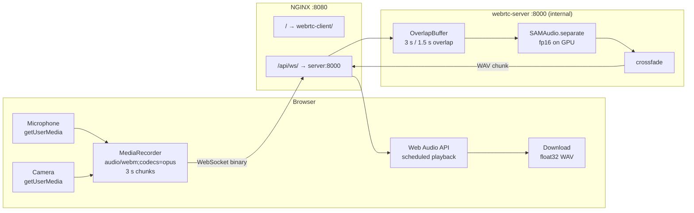

# Running the WebRTC App

Browser-based live audio separation: capture mic + camera → SAM-Audio on GPU → download clean audio.

## File Map

```
webrtc-client/              Vanilla JS frontend (ES modules, no build step)
webrtc-server/              Python FastAPI backend (SAM-Audio WebSocket)
webrtc-nginx/               NGINX config + Dockerfile
webrtc-docker-compose.yml   Production compose file
webrtc-docker-compose.dev.yml  Dev override (bind-mounts + hot reload)
.env.webrtc.example         Template — copy to .env.webrtc and fill in
```

---

## Prerequisites

| Tool | Windows 11 | macOS |
|------|-----------|-------|
| Docker Desktop ≥ 4.26 | Required | Required |
| NVIDIA driver ≥ 527 | Required for GPU | N/A |
| HuggingFace account | Required | Required |

GPU on macOS is not supported. The server falls back to CPU automatically — separation will work but will be ~50–100× slower.

### Windows 11 GPU setup — no WSL2 interaction needed

Docker Desktop uses WSL2 as its internal engine, but you never need to open a WSL2 terminal. GPU passthrough to containers is handled automatically by Docker Desktop since version 3.1 — as long as your NVIDIA driver is up to date.

**Steps (all in PowerShell or Windows Terminal):**

1. Install or update [Docker Desktop](https://www.docker.com/products/docker-desktop/) (≥ 4.26).
2. Make sure your NVIDIA driver is ≥ 527 — check with:
   ```powershell
   nvidia-smi
   ```
3. Verify Docker can see the GPU:
   ```powershell
   docker run --rm --gpus all nvidia/cuda:12.1.0-base-ubuntu22.04 nvidia-smi
   ```
   If this prints your GPU info, you're done. No further setup required.

> **WSL2 manual setup is only needed** if you are running Docker Engine directly inside a WSL2 distro (without Docker Desktop). That is an advanced workflow — if you installed Docker Desktop normally, skip it entirely.

---

## Quick Start

### 1. Create your env file

```bash
cp .env.webrtc.example .env.webrtc
```

Open `.env.webrtc` and set at minimum:

```env
HF_TOKEN=hf_your_token_here   # get from huggingface.co/settings/tokens
```

Request model access at [facebook/sam-audio-large](https://huggingface.co/facebook/sam-audio-large) if you haven't already.

### 2. Build and start (production mode)

```bash
docker compose -f webrtc-docker-compose.yml up --build
```

Open **http://localhost:8080** in Chrome or Firefox.

> First run downloads model weights (~9 GB for large). Subsequent starts load from the `hf-cache` Docker volume instantly.

### 3. Use the app

1. Type what you want to keep in the **"What to keep"** field (e.g. `person speaking`)
2. Click **Start Recording** — browser asks for camera + mic permission
3. Wait ~3–5 s for the first processed chunk to arrive (model warm-up)
4. Click **Stop** when done
5. Click **Download separated.wav**

---

## Development Mode (live editing)

```bash
docker compose -f webrtc-docker-compose.yml -f webrtc-docker-compose.dev.yml up --build
```

| What you change | How to see it |
|-----------------|---------------|
| `webrtc-client/` JS or CSS | Refresh the browser tab (no container restart) |
| `webrtc-server/webrtc_server/` Python | `uvicorn --reload` restarts the server automatically |
| `webrtc-nginx/conf.d/default.conf` | `docker compose restart nginx` |

**Tip:** Use `SAM_MODEL=facebook/sam-audio-small` in `.env.webrtc` during development to cut GPU warm-up time roughly in half.

---

## Configuration Reference (`.env.webrtc`)

| Variable | Default | Description |
|----------|---------|-------------|
| `HF_TOKEN` | — | **Required.** HuggingFace access token. |
| `NGINX_PORT` | `8080` | Host port for the browser. |
| `SAM_MODEL` | `facebook/sam-audio-base` | Model variant. `base` fits RTX 4070 Laptop (8 GB). Use `large` only on 12 GB+ VRAM. |
| `SAM_RERANKING_CANDIDATES` | `1` | Higher = better quality, more VRAM. Keep at 1 on 8 GB cards. |
| `CHUNK_SECONDS` | `3.0` | Audio chunk duration sent to the model. |
| `OVERLAP_SECONDS` | `1.5` | Overlap between chunks for crossfade (must be < CHUNK_SECONDS). |
| `DEVICE` | _(auto)_ | Force `cuda` or `cpu`. Leave empty for auto-detection. |

---

## Architecture Recap



Latency on RTX 4070: **~2–4 s** end-to-end. See [realtime-webrtc.md](./doc/realtime-webrtc.md) for the full analysis.

---

## Full Cleanup

Run these steps in order to leave your machine exactly as it was before.

### 1. Stop and remove containers, networks, and volumes

```bash
docker compose -f webrtc-docker-compose.yml down --volumes --remove-orphans
```

`--volumes` removes the `hf-cache` named volume (model weights, ~9–15 GB).
`--remove-orphans` removes any leftover containers from previous runs.

### 2. Remove the built images

```bash
docker image rm \
  understanding-sam-audio-nginx \
  understanding-sam-audio-webrtc-server \
  2>/dev/null || true
```

> Image names are derived from the compose project name (the repo folder name) + service name.
> Run `docker images | grep sam-audio` first if you're unsure of the exact names.

### 3. Prune dangling build cache

The multi-stage build leaves cached layers that don't show up as named images:

```bash
docker builder prune --filter "until=24h" --force
```

To nuke the entire Docker build cache (affects all projects, not just this one):

```bash
docker builder prune --all --force
```

### 4. Verify nothing remains

```bash
# Should return nothing webrtc / sam-audio related
docker ps -a         | grep -i sam
docker images        | grep -i sam
docker volume ls     | grep -i sam
docker network ls    | grep -i sam
```

### 5. Remove your env file

```bash
rm .env.webrtc
```

### One-liner (steps 1–3 combined)

```bash
docker compose -f webrtc-docker-compose.yml down --volumes --remove-orphans \
  && docker image rm understanding-sam-audio-nginx understanding-sam-audio-webrtc-server 2>/dev/null || true \
  && docker builder prune --filter "until=24h" --force
```

---

## Troubleshooting

| Symptom | Likely cause | Fix |
|---------|-------------|-----|
| "This app requires Chrome or Firefox" | Safari / unsupported browser | Use Chrome ≥ 90 or Firefox ≥ 85 |
| Blank video, no mic prompt | HTTPS required on some deployments | Use `localhost` (HTTP is allowed) or add TLS |
| WebSocket error immediately | Server not ready / still loading model | Wait 10–30 s and retry; check `docker compose logs webrtc-server` |
| `CUDA out of memory` | VRAM exceeded | Set `SAM_MODEL=facebook/sam-audio-base` in `.env.webrtc` |
| `401 Unauthorized` pulling model | HF_TOKEN missing or no access | Set token, request model access on HuggingFace |
| Audio plays but sounds wrong | Wrong prompt | Try a more specific noun phrase, see [prompting-guide.md](./doc/prompting-guide.md) |
| Dev changes not picked up | Wrong compose file | Confirm you're using both `-f` flags |
