# Running the WebRTC App

Browser-based live audio separation: capture mic + camera → SAM-Audio on GPU → download clean audio.

## File Map

```
webrtc-client/              Vanilla JS frontend (ES modules, no build step)
webrtc-server/              Python FastAPI backend (SAM-Audio WebSocket)
webrtc-nginx/               NGINX config + Dockerfile
webrtc-docker-compose.yml   Production compose file
webrtc-docker-compose.dev.yml  Dev override (bind-mounts + hot reload)
.env.webrtc.example         Template — copy to .env.webrtc and fill in
```

---

## Prerequisites

| Tool | Windows 11 | macOS |
|------|-----------|-------|
| Docker Desktop ≥ 4.26 | Required | Required |
| NVIDIA driver ≥ 527 | Required for GPU | N/A |
| HuggingFace account | Required | Required |

GPU on macOS is not supported. The server falls back to CPU automatically — separation will work but will be ~50–100× slower.

### Windows 11 GPU setup — no WSL2 interaction needed

Docker Desktop uses WSL2 as its internal engine, but you never need to open a WSL2 terminal. GPU passthrough to containers is handled automatically by Docker Desktop since version 3.1 — as long as your NVIDIA driver is up to date.

**Steps (all in PowerShell or Windows Terminal):**

1. Install or update [Docker Desktop](https://www.docker.com/products/docker-desktop/) (≥ 4.26).
2. Make sure your NVIDIA driver is ≥ 527 — check with:
   ```powershell
   nvidia-smi
   ```
3. Verify Docker can see the GPU:
   ```powershell
   docker run --rm --gpus all nvidia/cuda:12.1.0-base-ubuntu22.04 nvidia-smi
   ```
   If this prints your GPU info, you're done. No further setup required.

> **WSL2 manual setup is only needed** if you are running Docker Engine directly inside a WSL2 distro (without Docker Desktop). That is an advanced workflow — if you installed Docker Desktop normally, skip it entirely.

---

## Quick Start

### 1. Create your env file

```bash
cp .env.webrtc.example .env.webrtc
```

Open `.env.webrtc` and set at minimum:

```env
HF_TOKEN=hf_your_token_here   # get from huggingface.co/settings/tokens
```

Request model access at [facebook/sam-audio-large](https://huggingface.co/facebook/sam-audio-large) if you haven't already.

### 2. Build and start (production mode)

```bash
docker compose -f webrtc-docker-compose.yml up --build
```

Open **http://localhost:8080** in Chrome or Firefox.

> ### First cold start — expect a long wait
>
> On the very first run the server downloads **~28 GB of model weights** before it can accept any connection. This happens because SAM-Audio is a pipeline of several independently hosted sub-models that are fetched on demand:
>
> | Sub-model | What it does | Approx. size |
> |-----------|-------------|-------------|
> | `facebook/sam-audio-base` | Main separation model | ~4 GB |
> | `facebook/sam-audio-judge` | Text-based re-ranking | ~3 GB |
> | `pe-av-large` | Vision encoder | ~5 GB |
> | `pe-a-frame-large` | Span predictor | ~4 GB |
> | T5, RoBERTa, ModernBERT | Text encoders | ~2 GB |
> | *(other dependencies)* | | ~10 GB |
>
> **Total: ~28 GB**, downloaded sequentially. On a typical 100 Mbps connection this takes **30–60 minutes**. The log will show `Waiting for application startup.` and appear completely stuck — that is normal. Each sub-model prints a progress bar when it starts downloading, so you will see bursts of output followed by silence.
>
> The full startup sequence looks like this — use it to track where you are:
> ```
> Waiting for application startup.         ← downloads start here, can take 30–60 min
> [registry] Processor loaded. Loading model weights …
> [base] SAMAudio: building model architecture …
> [model] building audio_codec …
> [model] building text_encoder …
> [model] building vision_encoder …
> [model] building transformer …
> [model] building visual_ranker …
> [model] building text_ranker …          ← downloads facebook/sam-audio-judge (~3 GB)
> [model] text_ranker done.
> [model] building span_predictor …       ← downloads pe-a-frame-large (~4 GB)
> [model] span_predictor done.
> [model] __init__ complete.
> [base] SAMAudio: loading checkpoint from … ← reads main checkpoint from disk
> [base] SAMAudio: done.
> [registry] Model loaded to CPU RAM. Moving to cuda …
> [registry] Converting to fp16 …
> [registry] .cuda() complete.
> Application startup complete.            ← browser works now
> ```
>
> To watch the cache grow while you wait:
> ```bash
> docker exec $(docker ps -qf name=webrtc-server) du -sh /app/hf_cache
> ```
> The number should increase every minute or so. If it stays at 0 B, check that `HF_TOKEN` is set correctly in `.env.webrtc`.
>
> **All downloads are saved to the `hf-cache` Docker volume.** Subsequent `docker compose up` calls skip all downloads and reach `Application startup complete.` in 2–4 minutes (just GPU load time). The volume survives image rebuilds — you only pay the 28 GB cost once.

### 3. Use the app

1. Type what you want to keep in the **"What to keep"** field (e.g. `person speaking`)
2. Click **Start Recording** — browser asks for camera + mic permission
3. Wait ~3–5 s for the first processed chunk to arrive (model warm-up)
4. Click **Stop** when done
5. Click **Download separated.wav**

---

## Development Mode (live editing)

```bash
docker compose -f webrtc-docker-compose.yml -f webrtc-docker-compose.dev.yml up --build
```

| What you change | How to see it |
|-----------------|---------------|
| `webrtc-client/` JS or CSS | Refresh the browser tab (no container restart) |
| `webrtc-server/webrtc_server/` Python | `uvicorn --reload` restarts the server automatically |
| `sam_audio/` Python | `uvicorn --reload` restarts the server automatically |
| `webrtc-nginx/conf.d/default.conf` | `docker compose restart nginx` |

**Tip:** Use `SAM_MODEL=facebook/sam-audio-small` in `.env.webrtc` during development to cut GPU warm-up time roughly in half.

Changes to `webrtc-docker-compose.dev.yml` itself are **not** hot-reloaded. After editing compose settings such as mounts, environment variables, or commands, recreate the affected container:

```bash
docker compose -f webrtc-docker-compose.yml -f webrtc-docker-compose.dev.yml up -d --force-recreate webrtc-server
```

---

## Configuration Reference (`.env.webrtc`)

| Variable | Default | Description |
|----------|---------|-------------|
| `HF_TOKEN` | — | **Required.** HuggingFace access token. |
| `NGINX_PORT` | `8080` | Host port for the browser. |
| `SAM_MODEL` | `facebook/sam-audio-base` | Model variant. `base` fits RTX 4070 Laptop (8 GB). Use `large` only on 12 GB+ VRAM. |
| `SAM_RERANKING_CANDIDATES` | `1` | Higher = better quality, more VRAM. Keep at 1 on 8 GB cards. |
| `CHUNK_SECONDS` | `3.0` | Audio chunk duration sent to the model. |
| `OVERLAP_SECONDS` | `1.5` | Overlap between chunks for crossfade (must be < CHUNK_SECONDS). |
| `DEVICE` | _(auto)_ | Force `cuda` or `cpu`. Leave empty for auto-detection. |

---

## Architecture Recap

```mermaid
flowchart LR
    subgraph Browser
        MIC[Microphone\ngetUserMedia]
        CAM[Camera\ngetUserMedia]
        REC[Web Audio capture\nmono float32 PCM\n~250 ms flush]
        PLAY[Web Audio API\nscheduled playback]
        DL[Download\nassembled WAV]
    end

    subgraph NGINX["NGINX :8080"]
        STATIC["/ → webrtc-client/"]
        PROXY["/api/ws/ → server:8000"]
    end

    subgraph Server["webrtc-server :8000 (internal)"]
        BUF[OverlapBuffer\n3 s / 1.5 s overlap]
        SAM[SAMAudio.separate\nfp16 on GPU]
        CF[crossfade]
    end

    MIC & CAM --> REC
    REC -->|WebSocket binary\npcm_f32le| PROXY
    PROXY --> BUF --> SAM --> CF
    CF -->|WAV chunk| PROXY
    PROXY --> PLAY --> DL
```



The browser now plays separated audio automatically as processed WAV chunks arrive, and the **Download separated.wav** button assembles those same decoded chunks after you stop the session.

Latency on RTX 4070: **~2–4 s** end-to-end after the model is warm. See [realtime-webrtc.md](./doc/realtime-webrtc.md) for the earlier WebRTC/WebM transport analysis.

---

## Full Cleanup

Run these steps in order to leave your machine exactly as it was before.

### 1. Stop and remove containers, networks, and volumes

```bash
docker compose -f webrtc-docker-compose.yml down --volumes --remove-orphans
```

`--volumes` removes the `hf-cache` named volume (model weights, ~28 GB).
`--remove-orphans` removes any leftover containers from previous runs.

### 2. Remove the built images

```bash
docker image rm \
  understanding-sam-audio-nginx \
  understanding-sam-audio-webrtc-server \
  2>/dev/null || true
```

> Image names are derived from the compose project name (the repo folder name) + service name.
> Run `docker images | grep sam-audio` first if you're unsure of the exact names.

### 3. Prune dangling build cache

The multi-stage build leaves cached layers that don't show up as named images:

```bash
docker builder prune --filter "until=24h" --force
```

To nuke the entire Docker build cache (affects all projects, not just this one):

```bash
docker builder prune --all --force
```

### 4. Verify nothing remains

```bash
# Should return nothing webrtc / sam-audio related
docker ps -a         | grep -i sam
docker images        | grep -i sam
docker volume ls     | grep -i sam
docker network ls    | grep -i sam
```

### 5. Remove your env file

```bash
rm .env.webrtc
```

### One-liner (steps 1–3 combined)

```bash
docker compose -f webrtc-docker-compose.yml down --volumes --remove-orphans \
  && docker image rm understanding-sam-audio-nginx understanding-sam-audio-webrtc-server 2>/dev/null || true \
  && docker builder prune --filter "until=24h" --force
```

---

## Headless CLI

Run the full separation + STT pipeline on a local file — no browser, no WebSocket server required.
Useful for comparing model quality across `sam-audio-small / base / large` on the same golden file.

### Getting files into the container

The dev stack bind-mounts `./data/` on your host to `/data` inside the container. Drop any input files there — no `docker cp` needed:

```
# On your host:
sam-audio/
└── data/
    └── recording.webm   ← put files here
```

They appear immediately at `/data/recording.webm` inside the container. Write outputs there too and they land back on your host automatically.

### Basic usage

```bash
# Shell into the running container
docker compose -f webrtc-docker-compose.yml -f webrtc-docker-compose.dev.yml \
    exec webrtc-server bash

# Inside the container:
python -m webrtc_server.cli /data/recording.webm "person speaking"
```

Input can be any format `torchaudio` supports: WebM, WAV, MP4, OGG.

### Common invocations

```bash
# Save separated + original WAV alongside transcripts
python -m webrtc_server.cli recording.webm "person speaking" --save-audio

# Write outputs to a specific directory
python -m webrtc_server.cli recording.webm "guitar" --out-dir results/guitar/

# Skip STT — test separation pipeline only (faster, no Azure key needed)
python -m webrtc_server.cli recording.webm "person speaking" --no-stt --save-audio

# One-liner from the host
docker compose -f webrtc-docker-compose.yml -f webrtc-docker-compose.dev.yml \
    exec webrtc-server \
    python -m webrtc_server.cli /data/recording.webm "person speaking" \
    --out-dir /data/results/ --save-audio
```

### Output files

| File | Content |
|---|---|
| `<stem>_transcript.txt` | Human-readable, recognized sentences only, with Δ latency |
| `<stem>_transcript.csv` | `time_sec, stream, type, delta_sec, text` — recognized sentences |
| `<stem>_transcript_full.csv` | Same columns including interim "recognizing" partials |
| `<stem>_separated.wav` | Separated audio (`--save-audio` only) |
| `<stem>_original.wav` | Mono-mixed original (`--save-audio` only) |

`AZURE_STT_KEY` must be set in `.env.webrtc` for transcript output. Separation works without it.

### Comparing models

Pass `SAM_MODEL` as an env var — no code change needed:

```bash
for model in small base large; do
    SAM_MODEL=facebook/sam-audio-${model} \
    python -m webrtc_server.cli golden.webm "person speaking" \
        --out-dir results/${model}/ --save-audio
done
```

### What `delta_sec` means

In the browser Δ is wall-clock latency. In the CLI it is the **audio-stream position** difference: for each `separated/recognized` event, `delta_sec` = its audio position minus the audio position of the most recent `raw/recognized` event. This tells you how many audio-seconds of lag the separation pipeline introduced, independent of how fast the batch ran.

---

## Troubleshooting

| Symptom | Likely cause | Fix |
|---------|-------------|-----|
| "This app requires a browser with Web Audio and getUserMedia support" | Unsupported browser | Use Chrome ≥ 90 or Firefox ≥ 85 |
| Blank video, no mic prompt | HTTPS required on some deployments | Use `localhost` (HTTP is allowed) or add TLS |
| WebSocket error / 502 immediately after startup | Server still downloading or loading model | Normal on first run — can take 30–60 min while ~28 GB of sub-models download. Watch the logs for the startup sequence and track cache growth with `docker exec $(docker ps -qf name=webrtc-server) du -sh /app/hf_cache` |
| `CUDA out of memory` | VRAM exceeded | Set `SAM_MODEL=facebook/sam-audio-base` in `.env.webrtc` |
| `401 Unauthorized` pulling model | HF_TOKEN missing or no access | Set token, request model access on HuggingFace |
| Audio plays but sounds wrong | Wrong prompt | Try a more specific noun phrase, see [prompting-guide.md](./doc/prompting-guide.md) |
| Dev changes not picked up | Wrong compose file | Confirm you're using both `-f` flags |
